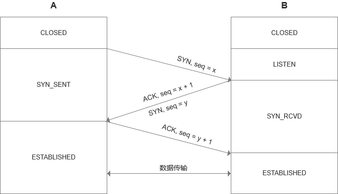

# 网络协议

TCP
-------

TCP是一种可靠的网络协议，很多应用层协议都依赖它。

### 包头格式

如图所示，源端口号和目标端口号用来确定发送和接收数据的双方。

包的序号为了解决包的先后顺序问题，确认序号为了确认发出去的包对方是否已经收到，如果没有收到就会有不断重传机制来确保不会丢包。

接下来是一些状态位，例如SYN表示发起一个连接，ACK是回复，RST是重新连接，FIN是结束连接等。TCP是面向连接的，因而双方都要维护连接的状态，这些带状态位的包的发送会引起双方状态的变更。

下面是窗口大小，因为TCP要做流量控制和拥塞控制，通信的双方需要各声明一个窗口来标识自己当前的数据处理能力。

### 三次握手
TCP建立连接的过程，请求>应答>应答之应答，我们常称为三次握手。也经常会有人问，为什么不是两次？为什么不是四次？

#### 连接过程
当A发起一个连接请求，会有很多种可能，比如包丢了、超时了、B没有响应等等。A无法确认结果，只能重复发送，即使B收到了，但A不知道，还是可能再发。

B收到以后，就知道了A的存在，以及A想和它建立连接。B若愿意建立连接的话，就需要发送一个应答包，但它若不能确定这个应答包A收到了，也就不能认为当前的连接以及建立好了。所以两次握手肯定是不行的。

A接收到应答包之后，对于A来说它的消息有去有回，A可以认为连接是建立的，它再发送应答之应答，到了B之后，B才认为它的消息也是有去有回的，B才能确认连接是建立的。

#### 初始化序列号
网络的不确定性会导致数据包的丢失、顺序颠倒、重复发送等问题，为了解决这些问题，TCP协议就要求发送方在数据包种加入序列号字段，有了序列号，接收方就可以通过序列号来对数据包去重和排序，发送方就可以在对应的数据包未被ACK时进行重复发送。

既然序列号的意义如此重要，那么在建立连接的时候就需要把序列号初始化好。A和B双方都需要向对方发送SYN控制消息并携带自己期望的初始化序列号SEQ，对方在收到SYN消息后会回复ACK控制消息以及SEQ+1来进行确认。这个过程可以表示为:

我们需要四条消息才能把序列号初始化好，由于TCP消息头的设计，B向A发送时可以一次性发送SYN和ACK消息，所以基于初始化序列号，我们也是需要三次握手的。

#### 历史连接
此外，A多次发送建立连接的请求，当网络状况较差时，B只能接受或拒绝A的请求，如果只有两次握手，B并不清楚这一次的请求是不是由于网络阻塞而早已过期的请求。

TCP在连接时引入了RST消息，当接收方发回给发送方`ACK, seq+1`时，发送方就可以根据时间来判断这是不是一条过期超时的消息，如果是，发送方就会发`RST`来中止这一次连接。

所以，三次握手和RST才能让发送的双方有足够的信息去判断当前的连接是否是错误的或者过期的。

### 四次挥手
TCP关闭连接的过程可以用状态时序图表示为:

和建立连接不同，关闭连接需要四步。A作为主动关闭方，先发送FIN，收到B的ACK后，A进入半关闭状态不能再发送传输数据。此时，B进入到了CLOSE_WAIT状态，这个状态是为了让B发送还未传输完的数据，传完之后B才能发出FIN，等到A回的ACK，B关闭连接。

但此时A进入TIME_WAIT状态，因为它没法知道ACK是否到达B。它等的结果无非是两种，要么B没有收到ACK，那么B就一定会为它的FIN消息进行超时重传，A就需要收到FIN之后再次发送ACK；要么B收到ACK了，那么A就可以关闭了，等待时间至少是B的timeout+FIN的传输时间，为保证可靠，采用了更加保守的等待时间2MSL(Maximum Segment Life)。

### 状态机
将建立连接和关闭连接的两个时序图合起来就是著名的TCP状态机：

### 流量控制

### 拥塞控制

UDP
-------

### 包头格式

和TCP相比，UDP具有非常简单的包头格式，可以说除了端口号就没有什么了。它不会去建立连接，只要监听相应的端口号，谁都可以传给他数据，他也可以传给任何人数据，甚至可以同时传给多个人数据。

### 与TCP比较
TCP是面向连接的，而UDP是面向无连接的。所谓建立连接，就是为了在客户端和服务端之间维护连接，通过一定的数据结构来维持双方交互的状态，来保证面向连接的特性。

TCP提供的是可靠交付，通过序号可以保证包不丢失、不重复、按序到达，但UDP是不保证不丢失，也不保证按顺序到达。

TCP面向字节流，发送的时候发的是一个流，没头没尾。而UDP继承IP包的特性，基于数据报，一个个地发，一个个地收。

TCP是可以进行拥塞控制的，它会根据网络环境调整自己发送的快慢，而UDP就不会。

TCP是有状态的，UDP是无状态的。

### 使用场景
基于UDP的特点，它适合于这些使用场景:

1. 需要资源少，在网络情况较好的内网或者对于丢包不敏感的应用
2. 无需一对一沟通，建立连接，而是可以广播的应用
3. 需要处理速度快，时延低，可以容忍少数丢包，但要求即便拥塞也一往无前的时候

Socket
-------
Socket在Linux中以文件的形式存在，它是一种特殊的文件，是对`打开open –> 读写write/read –> 关闭close`模式的一个实现。

在服务端和客户端通信之前，双方都要建立一个Socket，指定是IPv4还是IPv6，是基于数据流SOCK_STREAM的(TCP)还是基于数据报SOCK_DGRAM的(UDP)。

### 基于TCP
基于TCP协议的Socket程序函数的调用过程如下图所示:

服务端先调用bind函数为该socket赋予一个IP地址和端口，有了它就可以调用listen函数进入监听状态，客户端就可以发起连接。

服务端内核为每个Socket维护了两个队列。一个队列是已经建立了连接的，三次握手已完成，处于ESTABLISHED状态；另一个是还没有完全建立连接的，处于SYN_RCVD状态。

接着，服务端调用accept函数时，会拿出一个已完成的连接进行处理。如果没有已完成的连接，就要等着。服务端等待的时候，客户端可以通过connect函数发起连接，socket函数中声明要连接的IP地址和端口号，然后发起三次握手，一旦握手成功，服务端的accept函数会返回另一个socket。

所以，服务端监听用的socket和真正用来传输数据的socket是两个，分别叫做监听Socket和已连接Socket。连接建立成功后，双方开始通过read和write函数读写数据。

内核中既然socket是一个文件，那就有对应的文件描述符。每个进程中有个task_struct数组，里面指向该进程打开的所有文件，文件描述符可以理解为数组的index。每个文件又会有一个inode，socket对应的inode不像普通文件放在硬盘上，而是在内存中，这个inode指向了socket在内核中的Socket结构:

这个Socket结构主要是两个队列，发送队列和接收队列，队列里面保存的是缓存sk_buff，每个sk_buff就能看到完整的包的结构。

### 基于UDP
由于UDP的过程非常简单，没有建立连接，没有三次握手，只需要绑定IP和端口号。而且无需维护连接状态，服务端也就不需为每对连接建立一组socket，只需要一个socket就能和多个客户端通信，而且每次通信的时候通过调用sendto和recvfrom还能再传入IP地址和端口。

### 并发处理
通过之前的基于TCP或UDP的socket函数建立连接之后，需要一个while循环，客户端和服务端不断的接收数据，就构成了一个基本的网络交互程序。但这个程序是一对一的，如何让服务端能服务更多的客户端呢？

#### 多进程
当建立连接之后，就会有一个已连接的socket，这时候可以fork出一个子进程，把接下来的数据接收的事情交给子进程来做。在Linux内核，子进程会复制文件描述符的列表，以及内存空间，还有当前执行到程序的哪一条语句。之前父进程accept之后创建的已连接socket也是一个文件描述符，就会被子进程获得。子进程通信完毕后，就需要退出，需要父进程通过子进程PID来查看它是否需要退出。

#### 多线程
每次和一个客户端连接就创建一个进程是很奢侈的事情，相对而言，创建一个线程就要轻量级很多。这些线程共享文件描述符列表、进程空间，也可以通过已连接的socket来处理客户端请求。

但是一台机器无法创建过多的进程或线程，著名的[C10K](https://en.wikipedia.org/wiki/C10k_problem)问题就是指单机操作系统无法维护过多的进程或线程，在早期成为一个瓶颈。为了解决这个问题，就发明了IO多路复用的方式。

#### IO多路复用，select
select的方式是有一个线程专门去监控所有的socket，因为socket是文件描述符，所有的socket都可以放在一个叫做fd_set的集合中，然后select函数来监听这个集合是否有变化。一旦有变化，就依次查看每个文件描述符，那些发生变化的文件描述符在fd_set中对应的位会设为1，表示socket可读或可写，从而可以进行读写操作。接着再次调用select函数，进入下一轮变化的监听。

但是select仍然有个问题，就是当连接过多的时候，每次都通过轮询查看一遍fd_set效率不高。它虽然比多线程效率高很多，但仍然没有完全解决C10K的问题，于是有了epoll的方案。

[示例程序](https://github.com/hjlarry/practise-py/blob/master/standard_library/Concurrency/Select/select_echo_server.py)

#### IO多路复用，epoll
epoll通过注册callback函数，当某个文件描述符发生变化的时候，就会主动通知。

epoll_create会创建一个epoll对象，它也是一个文件，对应一个文件描述符，它里面有一个红黑树，这个红黑树中就保存着要监听的所有socket。当epoll_ctl添加一个socket时，就是把它加入这个红黑树，同时红黑树中的节点指向一个结构，并将这个结构挂在被监听的socket事件列表中。当一个socket发生一个事件的时候，可以从这个列表中得到epoll对象，并调用callback通知它。

epoll并非在所有情况都比select高效，例如在少于1024个文件描述符监听，且大多数socket都是处于活跃繁忙状态的时候，select会比epoll更高效，因为epoll会有更多次的系统调用，内核态和用户态的切换更为频繁。

[示例程序](https://github.com/hjlarry/practise-py/blob/master/standard_library/Concurrency/Select/select_poll_echo_server.py)

HTTP
-------

### 请求准备
当我们输入一个域名，按下回车键时，浏览器会将它发送给DNS服务器，让它解析为IP地址。接着就可以通过三次握手建立TCP连接了。如果是HTTP1.1的协议，它开启了Keep-Alive，这样建立的TCP连接会在多次请求中复用，从而减少了不断建立连接和断开连接的消耗。

### 请求构建
连接建立以后，就开始构建这样格式的请求:

#### 请求行
方法常用的有GET、POST、PUT、DELETE、HEAD、OPTIONS等。HEAD和GET请求同一个URL时服务端返回的响应头信息应该相同，只是对于HEAD服务端响应时不返回消息体，常用于测试该URL的有效性、是否有更新等。OPTIONS属于预检请求，常用于确认服务端该资源是否支持跨域以及支持哪些请求方法等。GET和HEAD属于安全的方法，GET、PUT、DELETE、HEAD、OPTIONS都是幂等的。

URL一般是相对路径。版本一般是`HTTP/1.1`。

#### 请求头
请求头都是一行行key-value的字段，比较重要的有：

* Host，HTTP/1.1中的必需字段，服务器的域名和端口号(80可忽略)
* User-Agent，浏览器身份标识字符串
* Content-Type，请求体的MIME类型(POST和PUT请求中)
* Authorization，认证信息

### 请求发送
HTTP协议基于TCP协议，所以它使用面向连接的方式发送请求，通过stream二进制流的方式传给对方。在TCP层，二进制了会变成一个个报文段发送给服务器，发送时要求对方有一个回应的ACK，没有回应就会重新传输直到可达。

TCP层发送每个报文时都会加上自己的地址和目标的地址，把这两个信息放在IP头里交给IP层传输。IP层查看目标地址是否和自己在一个局域网，如果是，就发送ARP协议来请求目标地址对应的MAC地址，然后将源MAC和目标MAC放入MAC头，发送出去即可；如果不在，就先多一步发送到网关，在通过ARP得到网关的MAC地址，把源MAC和网关MAC放入MAC头发出。

网关收到包发现MAC符合就取出目标IP地址，根据路由协议找到下一跳的路由器，获取下一跳的路由器MAC并将包发过去。这样一跳一跳最终到达目标的局域网，在这个局域网上发送ARP就可以获得目标地址的MAC，并将包发出去。

服务器发现MAC地址符合，根据IP头中的协议项知道是TCP协议，然后解析TCP头，根据里面的序号确定是要回ACK还是丢弃掉。TCP头里面有端口号，HTTP进程正在监听，于是服务器最终把包交给这个进程去处理。

### 返回构建
返回也有自己的格式:

状态码有五种可能的取值:

* 1**，指示信息，表示请求已接收，需请求者继续处理
* 2**，成功，操作被重新接收并处理
* 3**，重定向，要完成请求必须进行更进一步的操作
* 4**，客户端错误，请求语法错误或请求无法实现
* 5**，服务端错误，服务器处理请求过程中发生了错误

响应头重要的字段有:

* Content-Type，响应体的MIME类型
* Content-Length，响应体的长度
* Access-Control-Allow-Origin，指定哪些网站可参与到跨资源共享过程中
* Allow，对于该资源有效的动作(HTTP方法)
* Cache-Control，向从服务器直到客户端在内的所有缓存机制告知，它们是否可以缓存这个对象。如`Cache-Control: max-age=3600`
* Expires，超过该时间则认为此回应已过期
* Last-Modified，所请求的对象最后修改日期
* Location，用于重定向
* Refresh，设定可定时的重定向，例如`Refresh: 5; url=http://a.com`设定了5秒后跳转至a.com
* Set-Cookie，设置Cookie

响应构建好之后，也只是把请求发送的过程逆向来发送回去。

### HTTP 2.0
HTTP1.1在应用层是以纯文本的方式通信的，每次通信都要带上HTTP头部，在不考虑[pipeline](https://zh.wikipedia.org/wiki/HTTP%E7%AE%A1%E7%B7%9A%E5%8C%96)模式的情况下，每次的过程都是一去一回，这样在实时性和并发性上都有问题。

为了解决这些问题，HTTP 2.0对HTTP头进行了压缩，将原来每次都要携带的头部key-value在两端都建立了一个索引表，对相同的字段只发送表中的索引即可。

另外，HTTP 2.0还将一个TCP连接分为若干个流，每个流中可以传输若干消息，每个消息由若干最小的二进制帧组成。常见的帧有Header帧，用于传输Header内容，并且会开启一个新的流；还有Data帧，用来传输正文实体，多个Data帧属于同一个流。

通过这两种机制，HTTP 2.0的客户端可以将多个请求分到不同的流中，然后将请求内容拆成帧，进行二进制传输。这些帧可以打散乱序发送， 然后根据每个帧首部的流标识符重新组装，并且可以根据优先级，决定优先处理哪个流的数据。例如:

HTTP 2.0其实就是将三个请求变成三个流，将数据分成帧，乱序发送到一个TCP连接中。

HTTPS
-------
HTTP协议最大的问题就是相当于在互联网上裸奔，任何一个中间人都可以截获客户端和服务端传输的数据包，没有任何隐私可言。HTTPS就是解决这个问题的，怎么解决？只能加密。

### 对称加密
在对称加密算法中，加密和解密使用相同的一个密钥。它的优点是加密解密的效率很高，但是密钥若被窃取存在安全风险。因此，保证数据安全只要去保证双方约定好的密钥没有其他人知道就行了。

那么新的问题就是，在http这个场景中，怎样让客户端和服务端约定一个密钥而不被中间人知晓？我们发现，无论怎样设计，除非是线下传输，否则仅靠对称加密没有办法可靠的把密钥发送给对方。

### 非对称加密
这时候我们想到了可以引入非对称加密的算法，它将密钥分为公钥和私钥。使用公钥加密的数据只能用私钥才能解开，使用私钥加密的数据也只有用公钥才能解开。它的优点是安全性高一些，缺点就是加解密的效率相比于对称加密就要差很多了。

这时，我们想往服务端传递一段信息，就可以使用服务端提供的公钥加密，这样其他人都解不开，只有服务端自己有私钥才能解开。我们传递的这段信息既然是安全的，就可以让这段信息是一个随机生成的对称加密算法的密钥，这样双方之后的通信都可以基于对称加密对于工作效率的提升就很大了。

### 证书

RPC
-------