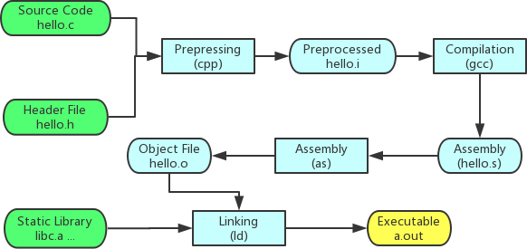
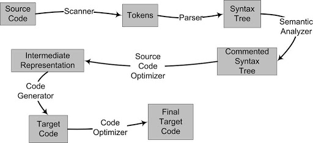

# 计算机科学基础知识之软件部分


操作系统
-------

**操作系统**是计算机体系的内核和基石，管理计算机硬件与软件资源。分为:

* 个人机: Windows, macOS, Linux/BSD
* 大型机: Linux, Unix
* 嵌入式: VxWorks
* 移动端: Android, Windows CE

因为Unix商业版权的原因，必须完全符合UNIX标准才能称为UNIX系统，其他的BSD/Linux只能称为UNIX-like。学术上的操作系统和我们日常口中说的操作系统不太一样，我们一般说的windows严格来说属于一个操作系统产品或者说一个操作系统的发行版，它是系统本身和一些软件(浏览器、扫雷)的打包，而学术上的操作系统指的是内核和一些必要的服务。

现代操作系统的基本功能包括:

* 内存管理(memory management)
* 进程管理(process management)
* 中断处理(interrupt handling)
* 文件系统(file system)
* 安全机制(protection and security)
* 进程通信(inter-process communications)
* 设备驱动(device driver)


内核
-------

**微内核**就是把最核心、最基础的部分单独作为内核，其他功能围绕它处理。包括地址空间、线程处理、进程通信等。这类东西它们需要以特权模式运行，其他基础服务当做普通应用程序独立运行。

在内核中运行的程序使用的内存，叫**内核空间**，也叫内核态。其他程序运行在**用户空间**，也叫用户态。用户态的代码需要在内核态运行时，并不是直接放在内核态中运行的，这样安全没法保证，首先会做权限检查，通过之后相当于提交了申请，内核运行完成以后返回结果唤醒用户态的程序，这就又涉及到了上下文切换和状态保存。所以用户态和内核态的切换会消耗大量的资源。

微内核的优点就是内核很小，裁剪起来方便，裁剪不同的基础服务就可以形成不同的版本面向不同的用户，另外就是其中某个服务崩溃的话不会影响到内核，内核可以重启改服务。当然缺点就是由于处于不同的地址空间，基础服务和内核通信时得使用类似于IPC(Inter-Process Communication)的方式通讯，效率相对会差一些。

微内核的典型代表是学术上的windows和macOS，而不是Linux，早期的Linux为了性能考虑采用了宏内核。

**宏内核**也叫单一内核，把核心和基础服务放在一个地址空间内均以特权模式运行，好处就是调用一些基础服务的时候相当于函数调用，不需要通讯，性能很高。缺点就是复杂度和耦合度很高，虽然代码是模块化的，但其中某个模块崩溃都可能导致整个系统崩溃，也不方便裁剪和移植。


现代的操作系统往往是采用混合内核的，并不是泾渭分明的。


系统调用
-------

**系统调用**是内核对外的接口，内核态的一些内核函数。应用程序只要和硬件打交道都会涉及到系统调用，向操作系统申请并等待回复，应该尽量避免系统调用或考虑其他方式优化，比如有些场景可以使用在用户空间的带buffer的文件替代操作系统提供的文件读写API。

典型的系统调用汇编代码:

global _start 

section .data
    hello : db `hello, world!\n`
section .text 
    _start:
        mov rax, 1      ; system call number should be store in rax
        mov rdi, 1      ; argument #1 in rdi: where to write (descriptor)?
        mov rsi, hello  ; argument #2 in rsi: where does the string start?
        mov rdx, 14     ; argument #3 in rdx: how many bytes to write?
        syscall         ; this instruction invokes a system call
        
        mov rax, 60     ; 'exit' syscall number
        xor rdi, rdi
        syscall

C语言、Go语言通过标准库进行系统调用，他们的标准库中的函数也只是在汇编之上的一种包装。在汇编语言中通过在不同寄存器中放不同的参数，再执行`syscall`这条指令就可以进行系统调用。`syscall`是64位操作系统改进的一条指令，x86下是`int 0x80`，这种改进效率上也更高一些。

RAX寄存器存放不同系统调用的序号，相当于函数名称；RDI、RSI、RDX、R10、R8、R9依次存放参数；再用RAX存返回值。这是系统调用的调用约定。可以通过[这里](http://blog.rchapman.org/posts/Linux_System_Call_Table_for_x86_64/)查看到系统调用函数有哪些，分别是如何传参的。


文件系统
-------
大多数Linux发行版的文件系统都有着非常类似的结构，除了`ls`，`tree`也是一个很好的观察其结构的工具。常用的目录及其用途:

* /bin，包含基本的系统级二进制可执行文件，例如`ls`
* /sbin，包含需要root权限才能执行的可执行文件
* /usr，只读的用户数据
    - /usr/bin，非必须的或者是用户自己安装的可执行文件
    - /usr/sbin，非必须的二进制文件，但需root执行
    - /usr/local/bin，用户自行编译后的文件
* /home，用户的个人目录
* /root，root用户的目录，root是特殊用户所以不会放在/home中
* /dev，设备文件，通常是硬件设备的接口文件
* /etc，包含了大部分的系统配置文件，例如系统名称、硬盘上的安装位置等
* /lib，库文件以及显卡、声卡等硬件工作的驱动文件
* /opt，用户安装一些大型程序，或者是一些服务程序的安装目录
* /sys，包含系统的信息，和连接到计算机的设备的信息
* /var，最初这样命名是因为它经常变化，存储日志等内容
* /tmp，临时文件，重启系统后里面的文件都会被删除

更多的目录结构及用途见[wiki](https://en.wikipedia.org/wiki/Filesystem_Hierarchy_Standard)。


进程和线程
-------

### 程序与进程
程序和进程有什么区别？

某个程序里包含了某个进程所需要的数据，但在某个时间点，进程中的内容未必和程序中的内容是一一对应的。我们开发一个程序，不仅包括可执行的代码，还有周边的素材等等，程序运行的时候，也未必会把全部内容都载入到内存。而**进程**指的是程序运行时，在内存当中受操作系统管理的部分。**程序**就像是蓝图，我们可以是照着同一份蓝图启动多个进程。

进程不是执行单位，而是一个资源边界。相当于在内存这个世界里面，进程圈了一块地，这块地有很多的属性，比如虚拟地址空间、PID等，而地上的工人、流水线才是执行单位，我们称为**线程**。所以每个进程都有一个主线程。

* 进程是程序的运行期实例(但不同操作系统对进程定义可能不同)
* 是系统动态执行基本单元
* 是系统资源分配单位
* 是线程的容器
* 是指令、数据及相关资源的集合
* 是程序运行过程的抽象

### 什么是线程
也称**轻量级进程**(LWP)，是进程中的实际执行单位，一个标准的线程由线程ID、当前指令指针(PC)、寄存器集合和堆栈组成。一个进程通常拥有一个或多个线程，这些线程之间共享程序的内存空间(包含代码段、数据段、堆等)以及一些进程级的资源(例如打开的文件、接收的信号等)。


线程是调度和时间片的分配单位，更多线程理论上会获得更多的CPU资源，同一程序的多个线程是可以在多核处理器上并行执行来提高执行吞吐率的，当然这也要看操作系统的调度策略。

### 线程调度
在单CPU的设备上，并行是模拟出来的，多线程程序轮流执行，每个线程每次仅执行一小段时间，这样不断在处理器上切换不同的线程去执行的行为我们称为**线程调度**(Thread Schedule)。在调度中，线程通常至少有三种状态:

* ready: 线程可以立刻执行，但CPU已经被占用
* running: 占用CPU资源，正在执行
* waiting: 此时线程正在等待某一件事情(通常是IO或同步)发生，无法执行

它们在如下情况会发生状态变化:


线程的调度随着操作系统的发展已经是各种复杂的方案和算法的结合，但主流的算法都带有**优先级调度**(Priority Schedule)和**轮转法**(Round Robin)的痕迹。轮转法就是让各个线程轮流执行一小段时间，而优先级调度又决定了线程按照什么顺序来轮流执行。此外，我们把线程执行完时间片，而被强制剥夺执行权利的过程称为**抢占**，非抢占式的调度模式也已越来越少。

### Linux的多线程
Windows对进程和线程的实现如同教科书一般标准，但对于Linux，它的内核中并不存在真正意义的线程概念。Linux将所有执行的实体(无论线程还是进程)都称为任务，每个任务类似于一个单线程的进程，它有内存空间、执行实体、文件资源等。但不同的任务之间是可以共享内存空间的，从这个角度，共享了同一个内存空间的多个任务构成了一个进程，这些任务也就成了这个进程里的线程。

Linux提供的创建新任务的API包括fork、exec、clone。fork通过复制当前进程产生一个新的任务，但并不复制原任务的内存空间，而是和原任务共享一个写时复制的内存空间。所以它产生新任务的速度很快，但它只能产生本任务的镜像，这时就要通过exec配合则可以启动一个别的新的任务。如果要产生的不是任务而是新线程，则可以用clone，它产生新的任务并从指定的位置开始执行，共享当前进程的内存空间(可选的)，从实际效果上来说就产生了一个新的线程。

### 线程模型
**内核线程和用户线程是有区别的**，我们一般使用的线程都是被包装过的，很少通过系统调用来使用线程，用户线程往往是内核线程的包装体。

对于一个用户线程对应一个内核线程，我们称为**一对一模型**。这种模型下线程之间的并发是真正的并发，一个线程阻塞时其他线程的执行不受影响。但它的缺点也很明显，很多操作系统会限制内核线程的数量，用户线程的数量也就被限制了，而且内核线程的调度上下文切换的开销很大，导致用户线程的执行效率也不高。

多个用户线程映射到一个内核线程即**多对一模型**。线程之间的切换由用户态的代码来进行，相对于一对一线程切换会快很多，但如果一个用户线程阻塞，其他用户线程也无法执行，因为此时内核线程也阻塞了。

还有一种是**多对多模型**，类似于Go的机制，某个时刻一个用户线程必然对应一个系统线程，但总体来看用户线程可能比系统线程更多或者更少，同时用户线程的数量不受限制，某用户线程的阻塞也不会让所有的用户线程都阻塞掉。

为什么要包装内核线程呢？假如我们再做一个文件读操作，它要通过系统调用来完成，实际会分为用户态代码和内核态代码，这就涉及到上下文的切换，内核线程的调度、创建等，如果这种文件读操作很频繁，那么成本是很高的。我们就会考虑，在用户态和内核态的基础上能不能建立类似于Pool的模型来复用。这样一来，内核态的系统线程负责执行，用户态的用户线程负责存储状态，从而避免了频繁创建系统线程，用户态可以创建很多用来存储状态的执行单位，执行时把它绑定到一个内核线程中去，执行完释放内核线程，内核线程把绑定状态删除后放入池中，不需要杀掉内核线程，接下来另一个执行单位重新绑定到该内核线程中去执行。

所以当我们选择一门语言或者一种并发库的时候，是要知道它究竟由内核线程实现还是用户线程实现的，这在性能上是有很大区别的。


并发与并行
-------

### 基础概念
**并发与并行**关注的是程序逻辑的执行。并发是从逻辑角度出发的，指的是多个任务能同时执行，这个同时是相对的概念，比如在一小时内完成。而并行是指物理上的同一时刻执行多个并发任务，这就要求多机器或多核。所以说并发是并行的基础，并行是并发的理想执行模式。

**同步和异步**关注的是消息通信机制。同步就是在调用者发出一个调用时，主动等待该调用的结果。而异步则是发出调用之后就不管了，调用者不会立即得到结果，等待被调用方通过状态、通知等告诉调用者，或是通过回调函数处理该调用。

**阻塞和非阻塞**关注的是程序在等待调用结果(消息或返回值)时的状态。阻塞调用是指调用结果返回之前，当前线程被挂起，只有在得到结果之后才返回。非阻塞调用是指在不能立刻得到结果之前，该调用并不会阻塞当前的线程。

### 并发模型
实现并发通常有三种模型，即多进程、多线程、协程。

多进程模型把线程a封装到进程1，把线程b封装到进程2，然后用多个进程执行。对于CPU密集型场景，好处有三点:

* 对于操作系统来说，这个进程的优先级好控制，分配的时间片和接收任务的时间片是分离的
* 容易部署迁移至其他机器。两个进程相互通信最简单的方式是RPC或Socket、MQ、数据库等
* 数量更有弹性。在一个进程里创建多个线程对于操作系统来说都是被监管的，并没有多个进程处理起来更流畅

多进程的缺点就在于数据复制以及创建进程时的开销大了。

正常情况优先使用多线程模型，多线程会尽可能多的获取时间片，操作系统有操作时间片的调度器，该调度器会计算每个线程的时间片使用完以后保存线程的寄存器等状态，进行上下文的切换。

协程模型是程序通过自己切换的方式实现在单个线程内、单个CPU上执行来提高CPU的利用率，它充分利用了IO等待时浪费的时间片。


虚拟存储器
-------

### 基础概念
操作系统会有一个很大的地址空间，也叫**虚拟地址空间**。这个空间的前面一大段是操作系统用的，之后的每个进程也都会有一个独立的很大的地址空间。这样不同的程序可以使用相同的虚拟地址，当程序在运行时访问某个地址就是访问进程内的虚拟地址，通过**内存管理单元**(MMU，一般集成在CPU内部)翻译映射到一个物理地址。这样的好处就是无论在程序内的地址空间怎么折腾都不会影响到其他的程序，对编译器也更友好更方便，可以提前分配。

我们在编译时看到的都是虚拟地址，物理地址在运行期才能看到。虚拟地址空间未必会全部映射到主存中，也会给各个设备保留一段空间。

**虚拟存储器**可以看成硬盘保存的一个字节数组，虚拟地址空间有256TB，而实际的物理内存可能只有8GB，有这么大的虚拟地址空间就不能阻止程序去使用，不够的物理存储体我们就通过硬盘上的交换分区来弥补。也有可能物理内存加上交换分区都不够程序使用，在Linux中就会引发OOM机制。

### 分段与分页
最开始的时候，压根没有虚拟内存，人们在物理内存上直接为某程序分配内存，这样带来的问题有:地址空间不隔离，恶意的程序可以轻松改写别人的数据；内存使用效率低，比如当前正在运行A和B，这时候需要运行C但内存不够，就需要把整个A或B换出到硬盘再载入C；程序运行的地址不确定，给程序的编写造成了一定的麻烦。  

然后引入了虚拟内存，人们开始使用一种分段(Segmention)的方法，把一段程序需要的内存大小的虚拟地址空间映射到物理地址空间，由操作系统和硬件来完成它们之间的相互转换。这样解决了没有虚拟内存时的地址空间不隔离和程序运行地址不确定的问题，但对于内存效率的问题依然没有解决。

因此，现在都使用分页(Paging)的方法。把地址空间人为地分成固定大小的页，页的大小由操作系统和硬件决定。当我们把进程的虚拟地址按页分割时，会把常用的数据页和代码页装载到内存中，把不常用的代码和数据保存在硬盘里，需要用到时再从硬盘中取出:


如图所示，DP表示磁盘页，VP表示虚拟页，PP表示物理页。虚拟空间中有的页被映射到同一个物理页中，从而实现了内存共享。此外，可以给每个页设置权限属性，做到一个基础的保护。

### 内存分配过程
假设某个程序需要内存分配器分配10MB的内存，那么操作系统会怎么做呢？首先会划分出一个虚拟地址范围，然后返回起始地址的指针。它此时没有必要通过MMU分配真实的物理内存，因为有可能这段内存后续根本没有读写发生。接下来若写入数据，也只会以页(8KB)为单位一点点的去写，每次写入的时候操作系统再去补物理内存，采用一种**按需分配的机会主义原则**。具体如何实现呢？当向一个虚拟地址写入数据时，就会去MMU找对应的物理地址，没有找到就说明没有建立映射关系还没有分配物理内存，就会引发一个**缺页异常**(page fault)，操作系统内有专门的程序把这一页补上，来实现按需分配。

我们通过程序可以模拟这种虚拟内存和物理内存的关系:

#include <stdio.h>
#include <stdlib.h>

// gcc -g -O0 -o test test.c
// ./test
int main()
{
    const size_t length = 1024 * 1024 * 100;
    const size_t pause = length / 10;
    unsigned char *p = malloc(length); // 分配100MB内存
    unsigned char *x = p;
    for (int i = 0; i < (int)length; i++) // 循环写入数据
    {
        *x = 1;
        x++;
        if (i % (int)pause == 0) // 隔一段时间暂停一下便于观察
        {
            printf("%d\n", i);
            getchar();          // 可以让用户在命令行中随时控制运行进度
        }
    }
    free(p);
    return EXIT_SUCCESS;
}


观察运行结果:

[ubuntu] ~/.mac $ pidstat -r -p `pidof test` 1
│Linux 4.9.184-linuxkit (cabd4e519687)   12/06/19        _x86_64_        (2 CPU)│
│11:10:18      UID       PID  minflt/s  majflt/s     VSZ     RSS   %MEM  Command
│11:10:19        0       180      0.00      0.00  106908   21624   1.06  test
│11:10:20        0       180      0.00      0.00  106908   21624   1.06  test
│11:10:21        0       180      0.00      0.00  106908   21624   1.06  test
│11:10:22        0       180   2560.00      0.00  106908   31920   1.56  test
│11:10:23        0       180      0.00      0.00  106908   31920   1.56  test
│11:10:24        0       180   2534.65      0.00  106908   42216   2.06  test
│11:10:25        0       180      0.00      0.00  106908   42216   2.06  test
│11:10:26        0       180   2560.00      0.00  106908   52512   2.57  test
│11:10:27        0       180      0.00      0.00  106908   52512   2.57  test
│11:10:28        0       180      0.00      0.00  106908   52512   2.57  test
│11:10:29        0       180      0.00      0.00  106908   52512   2.57  test
│11:10:30        0       180   2560.00      0.00  106908   62544   3.06  test

VSZ表示虚拟内存，RSS表示物理内存，可以看到随用户的控制，数据不断写入，物理内存增加。

### 换入换出
假设这10MB内存已经分配下来，该程序却长时间不用，操作系统就会把这10MB内存的数据保存到硬盘的交换分区上，并对这些内存页的状态做变更，MMU的映射地址做变更，这些内存就可以去给别的程序用，这就叫**换出**(swap out)。下次重新激活该程序时，会把硬盘上交换分区的数据重新放回某些空闲的页并重新建立映射，这就是**换入**(swap in)。我们可以通过监控工具观察到系统内的换入换出情况:

[ubuntu] ~ $ dstat
You did not select any stats, using -cdngy by default.
--total-cpu-usage-- -dsk/total- -net/total- ---paging-- ---system--
usr sys idl wai stl| read  writ| recv  send|  in   out | int   csw
  3   4  77  16   0|  12M  101k|   0     0 |   0     0 |1464  2562
  0   0 100   0   0|   0     0 |   0     0 |   0     0 | 175   408
  0   0 100   0   0|   0     0 |   0     0 |   0     0 | 148   345
  0   0 100   0   0|   0     0 |   0     0 |   0     0 | 143   341
  
  // paging的in和out即为当前换入换出大小,int表示当前有多少中断,csw表示当前有多少上下文切换

当程序运行需要的内存大于机器的物理内存时，就可能造成频繁的换入换出，产生**颠簸效应**(thrashing)。

### 性能相关
如果程序需要性能更高、速度要有保障，就需要向操作系统申请锁死这段内存。同时，缺页异常属于内核级别的，有一定的开销，所以为了追求性能的极致，有的C程序会先进行一个初始化操作，缺页异常仍然会有只是会提前，在执行具体的算法时就会更高效不受缺页异常的影响，而一些高级语言可能会由于编译器的优化使得提前初始化写入被优化忽略掉。

物理内存分配还采用了**写入时复制**(copy-on-write)的机制，即A若引用一块内存，那么复制A到B的时候并不会复制这块内存，只有当去写入A或B的时候才会去复制这块内存，起到节约内存的目的。

对于服务器来讲，假设物理内存有8G，当前运行的程序只有4G，操作系统就会拿另外4G当做自己的cache用，比如缓存文件读写等，程序需要使用时再从cache里还回来。但对于桌面端用户来讲，GUI程序居多，占用内存也多，所以往往会有足够的内存来让用户载入一个程序的速度更快。服务器往往运行的程序数量和时间更长更稳定，所以不同操作系统的分配内存策略也不同。

某种角度上，假设所有数据都交换到硬盘上，我们可以认为所有的数据保存在硬盘上，内存上只保存活跃数据，**内存可以看成是硬盘的缓存**或者说L4，虚拟存储器就可以看成硬盘上一个巨大的数组。


寄存器
-------

由于寄存器数量很少，我们就给每个寄存器起了个名字，并分为:

* 通用寄存器:AX,BX,CX,DX,SI,DI,SP,BP,R8-R15
* 指令寄存器:IP(也叫PC)，用于读取程序执行的下一条指令地址
* 标志寄存器:FR，用于存放处理器的状态和运算结果

### 通用寄存器
我们在寄存器名称前加个R，表示64位的寄存器；加个E，表示32位的；不加表示16位的；同时AH表示AX的高位；AL表示AX的地位。可以通过gdb观察到这些寄存器的值。


(gdb) info registers
rax            0x66	102
rbx            0x0	0
rcx            0x22	34
rdx            0x33	51
rsi            0x22	34
rdi            0x11	17
rbp            0x7fffffffe580	0x7fffffffe580
rsp            0x7fffffffe550	0x7fffffffe550
r8             0x7ffff7dd0d80	140737351847296
r9             0x7ffff7dd0d80	140737351847296
r10            0x0	0
r11            0x0	0
r12            0x555555554540	93824992232768
r13            0x7fffffffe660	140737488348768
r14            0x0	0
r15            0x0	0
rip            0x5555555546b2	0x5555555546b2 <main+68>
eflags         0x206	[ PF IF ]
cs             0x33	51
ss             0x2b	43
ds             0x0	0
es             0x0	0
fs             0x0	0
gs             0x0	0
(gdb) set $rbx=0x8070605040302010
(gdb) p/x $ebx
$1 = 0x40302010
(gdb) p/x $bx
$2 = 0x2010
(gdb) p/x $bh
$3 = 0x20
(gdb) p/x $bl
$4 = 0x10


所以有了这些访问的手段，一个寄存器是可以分割为不同的部分，存储不同内容的。通用寄存器用来存什么都可以，只是由于C语言出现的早，它对各个寄存器的一些用法就成了约定俗成的惯例，例如si、di用来传参，ax保存返回值，bp、sp表示栈底、栈顶，cx用来做循环等都是惯例。

但指令寄存器是在硬件层面上和其他寄存器有不同，专门用来放程序执行的下一条指令的。

### 标志寄存器
我们通过一个示例代码来观察标志寄存器的用途。


global _start

section .data
    hello   : db `hello,world!\n`

section .text

    _start:
        mov     rax, 1
        test    rax, rax ; 如果AX为0，则把ZF设为1，否则把ZF设为0
        jne     .exit    ; 如果ZF为0，则跳转至.exit标签

    .hello:
        mov     rax, 1
        mov     rdi, 1
        mov     rsi, hello
        mov     rdx, 14
        syscall

    .exit:
        mov     rax, 60
        xor     rdi, rdi
        syscall


标志寄存器有很多个位，ZF就是其中的一个位。哪个指令对哪个标志位有影响，都有手册可以查到，例如test指令可以通过[这里](https://baike.baidu.com/item/test/10804276#viewPageContent)查到，[jne](https://baike.baidu.com/item/jne)也是。

接着，我们在gdb中观察:

[ubuntu] ~/.mac/assem $ nasm -g -F dwarf -f elf64 -o fr.o fr.s
[ubuntu] ~/.mac/assem $ ld -o fr fr.o
[ubuntu] ~/.mac/assem $ gdb fr
...
(gdb) b 9
Breakpoint 1 at 0x4000b0: file fr.s, line 9.
(gdb) r
Starting program: /root/.mac/assem/fr

Breakpoint 1, _start () at fr.s:9
9	        mov     rax, 1
(gdb) display $rax
1: $rax = 0
(gdb) display $eflags
2: $eflags = [ IF ]
(gdb) n
10	        test    rax, rax ; ZF=1 if AX==0 else ZF=0
1: $rax = 1
2: $eflags = [ IF ]
(gdb) n
11	        jne     .exit    ; jmp if ZF==0
1: $rax = 1
2: $eflags = [ IF ]
(gdb) n
_start.exit () at fr.s:21
21	        mov     rax, 60


标志寄存器中若某位有值则会出现在eflags中，按当前代码逻辑，ZF为0会直接跳转到`.exit`部分。然后我们在gdb中修改`$rax`的值，会发现跳转至`.hello`部分。


(gdb) n
10	        test    rax, rax ; ZF=1 if AX==0 else ZF=0
1: $rax = 1
2: $eflags = [ IF ]
(gdb) set $rax=0
(gdb) n
11	        jne     .exit    ; jmp if ZF==0
1: $rax = 0
2: $eflags = [ PF ZF IF ]
(gdb) n
_start.hello () at fr.s:14
14	        mov     rax, 1
1: $rax = 0
2: $eflags = [ PF ZF IF ]


程序构建
-------
当我们使用C语言编写了一个输出hello world的小程序，只需要`gcc hello.c`就会得到一个目标文件`a.out`，然后直接打开就可以输出。但是它的背后却没有这么简单:



这个过程大体上分为预处理(Prepressing)、编译(Compilation)、汇编(Assembly)和链接(Linking)。

### 预处理
也叫预编译，这一步主要进行如下处理:

* 将所有的`#define`删除，并展开所有的宏定义
* 处理所有的条件预编译指令，如`#if`、`#ifdef`等
* 处理`#include`，将被包含的文件插入到该位置，这个过程是递归的
* 删除所有的注释`//`和`/* ... */`
* 添加行号和文件名标识，便于后续编译时能产生调试信息
* 保留所有的`#pragma`指令，它是用来设定编译器状态或特殊动作的

这一步可以用过`gcc -E hello.c -o hello.i`来完成，预处理后的代码并非二进制所以可以直接打开。

### 编译
这个过程是整个程序构建最核心的部分，可以细分为词法分析、语法分析、语义分析、中间语言生成和目标代码生成优化这些小步:



这个过程我们可以通过`gcc -S hello.i -o hello.s`来做。实际上在GNU的标准中，gcc只是一些后台程序的包装，预处理和编译都使用一个叫cc1的程序，汇编器是as，链接器是ld。

#### 词法分析
源代码被输入到扫描器(Scanner)，扫描器运用有限状态机(Finite State Machine)的算法将源代码的字符序列分割成一系列的记号(Token)并给它们分好类。比如`array[index] = (index + 4) * (2 + 6)`这样一行源码经过扫描后会产生如下记号:

| 记号(Token) | 类型 |
| --- | --- |
| array | 标识符 |
| [ | 左方括号 |
| index | 标识符 |
| ] | 右方括号 |
| = | 赋值 |
| ( | 左圆括号 |
| index | 标识符 |
| + | 加号 |
| 4 | 数字 |
| ) | 右圆括号 |
| * | 乘号 |
| ( | 左圆括号 |
| 2 | 数字 |
| + | 加号 |
| 6 | 数字 |
| ) | 右圆括号 |

产生的记号可以分类为关键字、标识符、字面量(包含数字、字符串等)和特殊符号(如加号、乘号等)。识别记号的同时，扫描器还会将标识符存在符号表，将字面量存放到文字表。

#### 语法分析
接着，语法分析器(Grammar Parser)会对扫描器产生的记号进行语法分析，从而产生语法树(Syntax Tree)。上例中的表达式得到的语法树为:


整个分析过程采用一种叫上下文无关语法(Context-free Grammar)的手段，整个语句被看成一个赋值表达式，其左边是一个数组表达式，右边是一个乘法表达式。在这一步，运算符的优先级和含义被确定了下来，例如`*`既可以是乘号又可以是指针，在该表达式中具体指什么就是在这一步确定的。

#### 语义分析
语法分析只是对表达式语法层面进行了分析，它不了解这个语句是否是真正有意义的，比如C里面指针的乘法运算是没有意义的，但它是合乎语法的。那么此时，语义分析器(Semantic Analyzer)可以完成对静态语义的分析。

静态语义(Static Semantic)是指在编译期可以确定的语义，通常包括声明和类型的匹配，类型的转换，例如把一个浮点数赋值给整型表达式，其中的隐式类型转换的过程就由语义分析完成。而动态语义(Dynamic Semantic)是指在运行期出现的语义相关问题，例如将0作为除数是一个运行期语法错误。

此阶段，语法树中的表达式都被标识了类型，符号表里的符号类型也做了更新:


#### 中间语言生成
编译器下一步要做的是源码优化，上例中的(2+6)这个表达式在这一步会被优化掉，因为它的值编译期就是可以确定的。这个阶段，源码优化器(Source Code Optimizer)会将语法树转换为中间代码(Intermediate Code)，它是语法树的顺序表示，在不同编译器有不同的类型，常见的有三地址码(Three-address Code)和P-代码(P-Code)。三地址码即`x = y op z`，表示将y和z操作的结果复制给x，所以上例表达式会被转换为:
```
t1 = 2 + 6
t2 = index + 4
t3 = t2 * t1
array[index] = t3
```
经过优化后就是:
```
t1 = index + 4
t2 = t1 * 8
array[index] = t2
```
中间代码将编译器分为前端和后端，前端负责产生与机器无关的中间代码，后端负责把这些中间代码转换为目标机器上的代码，如此可以让编译器使用一个前端、多个后端，从而具备跨平台的能力。

#### 目标代码生成与优化
编译器后端主要包括代码生成器(Code Generator)和目标代码优化器(Target Code Optimizer)。由于目标机器有不同的字长、寄存器、整数数据类型等，代码生成器也就不相同，以x86为例，上例中间代码生成的汇编代码为:
```
movl index, %ecx
addl $4, %ecx
mull $8, %ecx
movl index, %eax
movl %ecx, array(,eax,4)
```

接着，目标代码优化器会进行优化，例如选择合适的寻址方式、通过位移来代替乘法运算、删除冗余指令等。上例中乘法可以由一条相对复杂的基址比例变址寻址(Basic Index Scale Addressing)的lea指令来完成，优化后的代码为:
```
movl index, %edx
leal 32(,%edx,8), %eax
movl %eax, array(,%edx,4)
```

### 汇编
汇编器是将汇编代码转变成机器可以执行的指令，每一个汇编语句几乎对应着一条机器指令。所以这一步其实相对简单，没有优化解析的过程，只需一一翻译就可以了。可以通过`gcc -c hello.s -o hello.o`来得到目标文件(Object File)。

### 链接


可执行文件
-------

  

一个**可执行程序**看上去像是单个文件的数据库，我们以ELF格式的可执行文件为例，它包括头部元数据、Section header table、Program header table和各个section段。

### Head
文件头部包含一些元数据，用于进程加载找入口地址等:


[ubuntu] ~/.mac/assem $ readelf -h hello
ELF Header:
  Magic:   7f 45 4c 46 02 01 01 00 00 00 00 00 00 00 00 00      // 魔法数，可以快速读取出来用于预判整个文件是不是一个合法的内容
  Class:                             ELF64          // ELF文件的格式
  Data:                              2's complement, little endian  // 大小端情况
  Version:                           1 (current)
  OS/ABI:                            UNIX - System V    // 哪个平台使用
  ABI Version:                       0
  Type:                              EXEC (Executable file)     // 哪种类型，可执行的还是需重定位的等
  Machine:                           Advanced Micro Devices X86-64
  Version:                           0x1
  Entry point address:               0x4000b0       //入口地址
  Start of program headers:          64 (bytes into file)
  Start of section headers:          736 (bytes into file)
  Flags:                             0x0
  Size of this header:               64 (bytes)
  Size of program headers:           56 (bytes)
  Number of program headers:         2
  Size of section headers:           64 (bytes)
  Number of section headers:         8
  Section header string table index: 7


### Section
头部之后紧跟着各种各样的表，我们称之为**Section**(段)，各个section被计入可执行文件的Section header table中，我们可以这样查看:


[ubuntu] ~/.mac/assem $ readelf -S hello
There are 8 section headers, starting at offset 0x2e0:
Section Headers:
  [Nr] Name              Type             Address           Offset
       Size              EntSize          Flags  Link  Info  Align
  [ 0]                   NULL             0000000000000000  00000000
       0000000000000000  0000000000000000           0     0     0
  [ 1] .text             PROGBITS         00000000004000b0  000000b0
       0000000000000025  0000000000000000  AX       0     0     16
  [ 2] .data             PROGBITS         00000000006000d8  000000d8
       000000000000000e  0000000000000000  WA       0     0     4
  [ 3] .stab             PROGBITS         0000000000000000  000000e8
       0000000000000084  0000000000000014           4     0     4
  [ 4] .stabstr          STRTAB           0000000000000000  0000016c
       0000000000000009  0000000000000000           0     0     1
  [ 5] .symtab           SYMTAB           0000000000000000  00000178
       0000000000000108  0000000000000018           6     7     8
  [ 6] .strtab           STRTAB           0000000000000000  00000280
       0000000000000027  0000000000000000           0     0     1
  [ 7] .shstrtab         STRTAB           0000000000000000  000002a7
       0000000000000036  0000000000000000           0     0     1
Key to Flags:
  W (write), A (alloc), X (execute), M (merge), S (strings), I (info),
  L (link order), O (extra OS processing required), G (group), T (TLS),
  C (compressed), x (unknown), o (OS specific), E (exclude),
  l (large), p (processor specific)


其中，`Address`表示这个section加载到进程中的虚拟内存地址，`Offset`表示这个section相对于文件头部的偏移量，有了`Offset`+`Size`进程才知道如何安排相应的`Address`。`Flags`表示权限标志位，`A`表示这个section的内容需要在内存中载入，`X`表示可执行的权限，`W`表示可写入的权限。

`.text`用于存放二进制的执行代码(指令)。我们可以看到这个段的地址恰好是文件头中的Entry point address。

`.data`用于存放所有已经初始化过的全局变量的数据，`.bss`用于存放未初始化的全局变量数据，虽然它们在内存中都需要相应的起始地址和内存区域，但在可执行文件中没必要用一定区域去记下`.bss`中的零值。`.rodata`专门用于保存只读数据，例如字符串的字面量，在很多语言中它都是只读的。

`.symtab`表示符号表，源码中的字面量、全局变量、函数名、类型名、文件名等会作为符号记录在该表中，会记录它们的类型、作用域和内存地址。对于程序运行来讲，符号表没有什么用，CPU不管什么符号、类型，它只需要内存地址。符号就相当于是内存地址的助记符，主要是便于我们调试和反汇编使用的。

### Segment
执行的时候，我们需要告诉操作系统，有哪些section需要载入为内存中的**segment**，这个信息被链接器放在Program header table中，操作系统的载入器以此信息来安排程序在内存中的样子，我们可以这样查看:


[ubuntu] ~/.mac/assem $ readelf -l hello
Elf file type is EXEC (Executable file)
Entry point 0x4000b0
There are 2 program headers, starting at offset 64
Program Headers:
  Type           Offset             VirtAddr           PhysAddr
                 FileSiz            MemSiz              Flags  Align
  LOAD           0x0000000000000000 0x0000000000400000 0x0000000000400000
                 0x00000000000000d5 0x00000000000000d5  R E    0x200000
  LOAD           0x00000000000000d8 0x00000000006000d8 0x00000000006000d8
                 0x000000000000000e 0x000000000000000e  RW     0x200000
 Section to Segment mapping:
  Segment Sections...
   00     .text
   01     .data


上面的section to segment mapping就表示把section中的`.text`段的内容放在内存中`00`号的segment上。在可执行文件中会把section分的很细，但在内存中可能会把一些section合并起来，忽略掉一些section，起到节约内存的目的。


函数调用
-------

**函数**本身相当于一个图纸，出了设计院它就是只读的，放在`.text`段中，线程参考图纸来执行。线程通过`IP/PC`寄存器知道执行到图纸的哪里，下一条指令是什么，主线程通过可执行文件的入口地址找到第一条指令。

### 调用堆栈
那么每个CPU核心只有一个IP寄存器，线程却有很多个怎么办？实际上在同一时刻，只有一个线程绑定了一套物理寄存器，若它的时间片用完了则由操作系统保存它对应的寄存器状态在某段内存中，下次轮到它执行时再恢复寄存器的状态。那么我们可以在抽象层面上理解为每个线程都有一套自己的寄存器。同时，这种切换线程需要消耗一定的资源，用于保存和恢复状态，用于内核态和用户态的切换。

函数执行过程中需要在线程中保存参数、返回值、局部变量等，这块内存叫做**栈**(Stack)。那么如果是嵌套调用，如何保存各函数的状态呢？


如左图所示，A函数嵌套了B函数，A要等待B执行完成之后再接着执行自己的逻辑。所以我们一般把栈内存竖着画，由底部的高位向低位分配，函数执行结束则把其对应的内存区域销毁，如右图所示。我们把每一个函数所占的格子叫**栈帧**(Stack Frame)，把整个A、B、C的调用层次称为**调用堆栈**(Call Stack)。程序出错时候我们看到一级级的错误信息就是通过调用堆栈追溯到的。

调用一个函数，在指令级别上还是有很大的开销的，所以有了**内联**(inline)的优化手段。

### 调用约定
接下来的问题是A调用B的时候，如何给B传递参数，如何接收B的返回值，要么A划定区域，要么B划定区域，要么用寄存器，要么用内存，我们把这种约定称为**调用约定**。以Go语言为例，若A调用B，则A会把自己的栈帧一分为二，下半部分存本地局部变量，上半部分存给B用的参数和B的返回值。若A调用B、C、D等多个函数，则上半部分占用多大空间按哪个函数的参数和返回值最大来算。如此一来，栈帧的大小是在编译期就能确定的，访问栈内某块内存只需根据相对位置，基于栈顶做加法或栈底做减法即可。

一般会把栈顶的地址放在SP寄存器，把栈底的地址放在BP寄存器。理论上，SP或者BP使用一个就够了，每个语言都有自己的选择。Go早期只用SP，后来也引入了BP，因为很多的调试器、自动化检测工具需要使用BP确定栈底的位置。

如果SP/BP用来存当前正在执行的B函数的栈帧，B执行完以后如何知道调用它的A函数的栈帧有多大呢？所以在两个栈帧之间还有一段空间用来存储A的BP/SP、IP，A在调用B的时候就把自己的BP/SP写进去，把自己调用完B之后下一条要执行什么指令写进IP，这叫**保存现场**。B执行完以后，通过这段空间恢复现场。接着，我们看看C语言和Go语言的保存现场和恢复现场分别是怎么做的。

#### Go语言

func add(x, y int) int {
	z := x + y
	return z
}

func main() {
	a, b := 0x11, 0x22
	s := add(a, b)
	println(s)
}


通过`go build -gcflags "-N -l" call.go`接着进行gdb调试:

(gdb) b 4
Breakpoint 1 at 0x452347: file /root/.mac/gocode/call.go, line 4.
(gdb) r
Thread 1 "call" hit Breakpoint 1, main.add (x=17, y=34, ~r2=0) at /root/.mac/gocode/call.go:4
4		z := x + y
(gdb) disass
Dump of assembler code for function main.add:
   0x0000000000452330 <+0>:	sub    rsp,0x10
   0x0000000000452334 <+4>:	mov    QWORD PTR [rsp+0x8],rbp
   0x0000000000452339 <+9>:	lea    rbp,[rsp+0x8]
   0x000000000045233e <+14>:	mov    QWORD PTR [rsp+0x28],0x0
=> 0x0000000000452347 <+23>:	mov    rax,QWORD PTR [rsp+0x18]
   0x000000000045234c <+28>:	add    rax,QWORD PTR [rsp+0x20]
   0x0000000000452351 <+33>:	mov    QWORD PTR [rsp],rax
   0x0000000000452355 <+37>:	mov    QWORD PTR [rsp+0x28],rax
   0x000000000045235a <+42>:	mov    rbp,QWORD PTR [rsp+0x8]
   0x000000000045235f <+47>:	add    rsp,0x10
   0x0000000000452363 <+51>:	ret
End of assembler dump.


我们可以把它的栈帧变化情况画出来:


#### C语言

int __attribute__((noinline, optimize("-O0"))) add(int x, int y)
{
    int z;
    z = x + y;
    return z;
}

int __attribute__((noinline)) main(int argc, char **argv)
{
    int x, y, a;
    x = 0x11;
    y = 0x22;
    a = add(x, y);
    printf("%d\n", a);
}


通过`gcc -g -O0 -o frame frame.c`接着进行gdb调试:

(gdb) b 5
Breakpoint 1 at 0x654: file frame.c, line 5.
(gdb) r
Breakpoint 1, add (x=17, y=34) at frame.c:6
6	    z = x + y;
(gdb) disass
Dump of assembler code for function add:
   0x000055555555464a <+0>:	push   rbp
   0x000055555555464b <+1>:	mov    rbp,rsp
   0x000055555555464e <+4>:	mov    DWORD PTR [rbp-0x14],edi
   0x0000555555554651 <+7>:	mov    DWORD PTR [rbp-0x18],esi
=> 0x0000555555554654 <+10>:	mov    edx,DWORD PTR [rbp-0x14]
   0x0000555555554657 <+13>:	mov    eax,DWORD PTR [rbp-0x18]
   0x000055555555465a <+16>:	add    eax,edx
   0x000055555555465c <+18>:	mov    DWORD PTR [rbp-0x4],eax
   0x000055555555465f <+21>:	mov    eax,DWORD PTR [rbp-0x4]
   0x0000555555554662 <+24>:	pop    rbp
   0x0000555555554663 <+25>:	ret
End of assembler dump.

同样可以画出图来:


#### 比较
相同点是在调用CALL指令的时候，先把main函数中执行完add函数的下一条指令(在IP寄存器中)存在栈里，在调用RET指令的时候，这条指令会被自动恢复入IP寄存器。

不同点是C语言通过`push`和`pop`指令入栈、出栈，让栈顶SP自动随着变化。而Go语言采用了`sub`、`add`指令直接计算栈顶地址。

此外，在C语言中，是优先通过寄存器传递参数和返回值，经常使用SI、DI寄存器传参，使用AX寄存器存储返回值，因为C是性能优先，寄存器肯定是最快的。Go是使用栈内存传参和返回值的，这和它本身Goroutine的运行方式有关。

### 栈和堆
堆、栈既是两种数据结构，也是函数执行单位，在不同的场景有不同的概念。

对于栈内存来讲，它是整块的，不需要垃圾回收器参与，访问的时候只需要根据BP、SP按相对位置进行访问，所以它的效率是非常高的。而堆内存是和单个线程无关的，是共享的，就会涉及到很复杂的内存管理方式，分配的时候要找到大小和位置合适的块，释放的时候要尽可能的避免内存碎片化。所以说，编译器有责任尽可能把数据分配在栈上。但是，栈上内存是按栈帧整块释放的，某些情况下如果某个变量要在不同的栈帧中维持，它的生命周期发生了改变，这种情况这个变量的内存就要在堆上分配了，这种现象就叫**逃逸**。逃逸也会带来严重的性能问题。