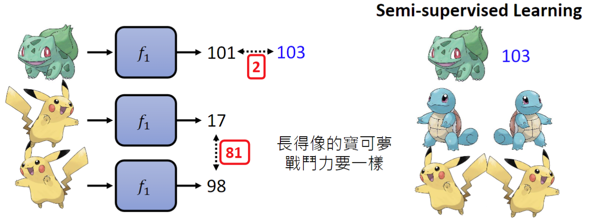
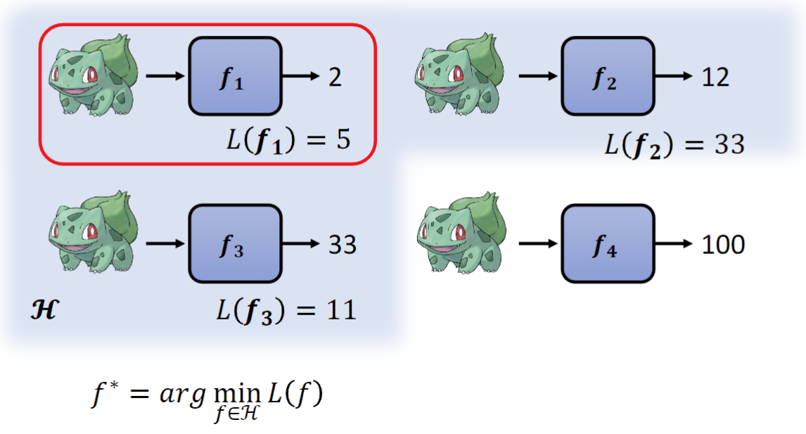
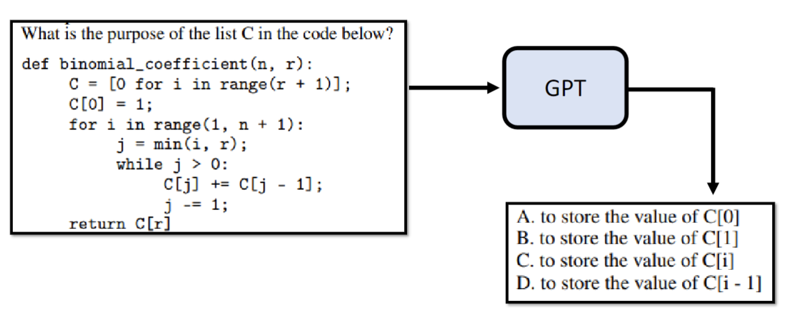
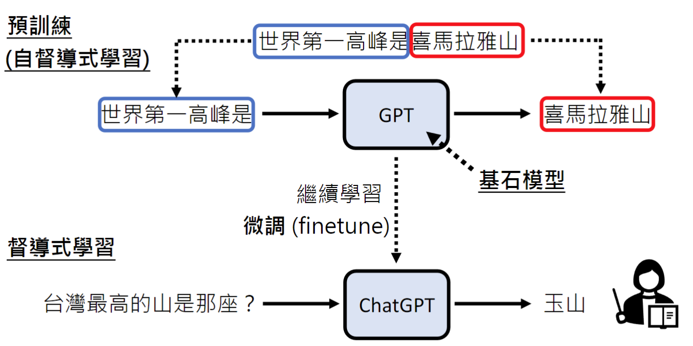

# Generative AI

## 机器学习

### 基本概念

机器学习的本质就是让机器找到一个函数，该函数的输入和输出可以达到人类的预期。

例如，对于ChatGPT我们的输入可以是一个问题“机器学习是什么？”，输出是一段答案；对于Midjourney，输入是一个指令“一只可爱的猫”，输出是一张图片；AlphaGo，输入的是整个围棋棋盘各棋子的位置，输出是下一步的位置。

根据函数类别的不同，可以把机器学习分为：

- **回归**（Regression），函数的输出是一个数值。比如输入今天的PM2.5浓度、气温、臭氧浓度等，预测明天的PM2.5值
- **分类**（Classification），函数的输出是一个类别。比如输入一封邮件，输出它是否是垃圾邮件
- **生成式学习**（Structured Learning），函数的输出是有结构的东西，包含图像、句子段落、语音视频等

### 找到函数

那么机器学习的核心问题变成了怎样找到一个函数？这需要三个步骤。假设我们现在的任务是评估出一个宝可梦精灵的战力值。

#### 1. 设定范围
设定范围就是要找出一个候选函数的集合（Model），而深度学习中类神经网络的结构（CNN、RNN、Transformer等）其实指的就是不同的候选函数集合。

#### 2. 设定标准
设定标准就是要找出一个评估函数好坏的标准（Loss Function）。

那么对于监督式学习（Supervised Learning），就相当于已经有了一个测试集，通过比较训练集和测试集之间的差异，就能够得到函数到底好不好。

这里训练集各个函数与正确答案的差异总和为15,那么`L(f1)=15`。

对于半监督式学习（Semi-supervised Learning），就相当于我们的测试集数据是不完全的，可以设定一个条件，长得像的宝可梦战斗力应该是一致的。

`L(f1)=2+长得像的宝可梦之间的差距`。

#### 3. 达成目标
达成目标就是要找出最好的函数，也就是最佳化（Optimization）。

在这个例子中，就是要找到函数集合H中损失最小的函数，而常见的梯度下降（Gradient Descent）、后向传播（Backpropagation）也是在做类似的事情。

#### 其他

Optimization本质上也是一个函数，它的输入就是函数集合H和损失函数，而它的输出就是找到损失最小的函数。因为H中的函数有很多，我们往往找不到其中损失最小的那一个，就需要人工去不断地调整Optimization的超参数（Hyperparameter），以更快的找到一个达到阈值的函数或者找到一个更低损失的函数。也有时候怎样调整超参数都没有用，这就说明Optimization对超参数不敏感。

我们需要设定一个范围内的候选函数集合，而不是把所有的函数都放在集合中，是因为我们需要找到的是一个在训练集和测试集都表现地很好的函数，而范围太大很容易出现的情况是在训练集上表现好，却在测试集上表现不好。在一个多大的范围内寻找，往往取决于经验以及训练资料的大小，训练资料越多，可以去划定的范围就越大。比如，Self-attention的范围比CNN要大，现在越来越多的图像训练转用Self-attention就是因为训练资料变多了。

## 生成式学习

### ChatGPT基本原理

当我们向ChatGPT提出一个问题时，它本质上是在一个文字接龙。它会把已有的这些文字当做输入，得到一批文字的概率分布，从这批文字中随机选择一个，和之前的输入一起再次执行计算下一个文字，直到遇到一个特殊标记比如`END`。这就是每次我们向ChatGPT提出同一个问题，它的答案可能会变化的原因。

从某种角度上讲，ChatGPT也属于机器学习中的选择分类函数，只不过它是从所有的文字中去选择下一个字，并不断迭代这一过程，最后统一呈现结果让我们认为它是属于生成式学习。

### GPT简介
GPT（Generative Pre-trained Transformer）是ChatGPT的基石模型（Foundation Model）。

传统的监督式学习提供给模型的训练资料是输入输出一一对应的，比如输入世界第一高峰是什么，输出是珠穆朗玛峰。这样的问题是我们人类能提供的成对的训练资料是有限的，我们需要找到一种办法让机器自己找到成对的输入输出，网络上的各种资料能够直接喂给它。

自监督式学习让机器能够从网络上每一段文字分析出输入输出，自己做文字接龙。

使用这个策略，2018年的GPT用了1G的数据和1.17亿的参数；2019年的GPT2使用了40G的数据和15.42亿个参数；2020年的GPT3使用了45T的数据和175B个参数。

### 预训练

GPT只使用网络上的资料去做文字接龙也是有问题的，比如问它问题的时候，它可能不会给一个答案，而是从网络上学习到的一个考题选项。

因此，我们需要继续去教导它，这就是微调（Finetune）。

预训练还有一个好处是当我们在多种语言上做了预训练后，只需要再教它某一个语言上的某一项任务，它就会自动学会其他语言上的同样任务。