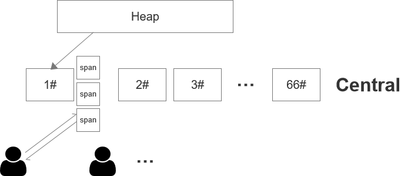

# 内存分配

有的语言会使用操作系统来管理内存，例如C语言。而现代大多数编程语言都会自主管理内存，因为这样能更好的解决内存复用的问题，便于减少内存的碎片化，同时可以和自己的垃圾回收器配合不断的迭代优化更新，也降低了开发者的门槛。

三层结构
-------

对于Go的内存分配器来讲，它有一些处理会比较麻烦，因为要支持高并发，分配的时候就会有一堆人去抢。这时候我们考虑的可能是分配的时候给每个人一个相对大块的内存来减少分配的次数，也就相应的减少了竞争的次数。同时还要考虑不用时需要进行内存回收来复用，我们可以用钢铁厂做个比方。每个人都需要用钢铁做东西，他们的用途可能不太相同，有人拿来做刀，有人拿来做剑，有人拿来做棍棒，有人拿来既做刀又做剑。面对这种情况，我们直接把钢铁厂的钢铁给用户自己去做就不太合适了，就需要在中间加一层生产商更合理。

这样做的好处是原本需要都去钢铁厂竞争做这把刀的用户，现在在制刀厂竞争了，而且若是一个用户做剑、另一个用户做棍，现在则没有冲突了。商品生产商这一层分散了竞争效应，原本x个人需要竞争一个锁变成了可以竞争n个锁。同时仍然可以一次性买10把刀，来减少和其他人抢的概率，这10把刀可以用来接着内部分配就没有人会来抢，当然这里会有一定的浪费，属于空间换时间的做法。

垃圾回收的时候，如果10把刀只用了2把，剩下的8把就可以返还给制刀厂，给其他人用。这实现了一级平衡，即在相同类型之间的平衡。也有可能由于种种原因出现刀冗余非常多的情况，这时候就可以把刀返还给钢铁厂全部熔了做其他东西，这属于二级平衡，在材料上的平衡。

通过这三层结构，我们实现了两个级别的平衡，达到了一定程度上的复用效果。那么需要多少种商品生产商呢？不可能因为每个人需求不同就给设定相应的商品生产商，我们需要对商品进行分类。对于内存分配器来说，它关心的是商品大小，先以32KB为界，把对象分为大对象和小对象。对于大于32KB的大对象，用户代码中这种对象往往很少，分配和回收都可以进行特殊对待。对于小对象，我们按照8字节对齐，分为66种SizeClass，例如8字节、16字节、32字节、48字节等等，对于1个9字节的对象，就会给它分配16字节，这可能会造成一定的空间浪费，但不至于产生过多的内存碎片。

现在，我们可以把钢铁厂叫做堆(Heap)，它向操作系统申请内存，负责管理原始材料。这66种商品生产商我们称为中间对象(Central)。再下面的人属于具体分配者，我们称为Cache，其实它就是缓存了一大批需要的东西接下来用于实际的分配。我们把每块从操作系统拿到的内存叫做Span，每个Span需要按一定规格进行切分，例如规格2就是按16字节来切分，切分后形成了若干个小块，每个小块我们称为Object。现在变成了这样:

每个Central分配的时候给的是一个切好了的Span，每个Cache返还的时候也是还整个Span，即使其中有部分Object被用掉了也只是标记一下。

接着还有一些其他问题，第一是操作系统虚拟地址分配的问题，我们希望是在某个固定的地址段之内紧凑的进行内存分配来避免内存碎片化。这样我们就需要先提前占用一段内存空间，做为保留空间，并不进行实际的分配动作，我们把这段空间叫arena。那么如何在进程中找到这样一段连续的地址空间呢？首先向操作系统申请内存，操作系统必然会给一个可用的虚拟内存地址；然后尝试按这个地址向右扩张，如果右边被堵住了就向左边扩张；如果两边都被堵住了就再次向操作系统申请内存，接着尝试向右向左扩张的操作。64位地址空间还是很大的，往往很容易找到这样一段空间。

第二是每个Span还需要位图(bitmap)来标记哪些是可用的，我们所说的切分Object也只是便于理解上的切分，实际上我们要找到一个可用的Object，就是用这个Span的起始地址加上位图中可用对象的偏移量乘以SizeClass的大小，即base+offset*size。

第三，我们还需要一个反查表，它记录了每个Span的起始地址。为什么需要这样一个表呢？假设某个Span里面有100个Object，我们只需要使用其中的10个Object，就可以根据反查表的信息把这个Span一分为二，把剩余的90个Object组成一个新的Span拿回来。拿回来之后还能通过反查表检查它左右相邻的Span是不是闲置的，如果闲置则可把他们合并为一个大的块。所以Span的大小可能不是固定的，根据需要可能会切分或合并。

分配过程
-------

现在我们可以整理一下整个内存分配的过程。首先堆Heap会向操作系统申请64MB内存，操作系统是机会主义的分配原则，实际上给你的是64MB的期货，之后以页为单位发生读写时分配物理内存。分配之后就有一大堆的Span需要去管理，Heap采用了树堆这种数据结构管理Span。树堆长得像树一样，同时增加了一些堆的特性，排序能按照地址来排序，它的好处是分配给Central时总是会尽可能找到一个大小合适而且地址靠前的Span，地址靠前使得内存相对来说更加的紧凑。Central拿到之后只是做一些属性的设置，重置一下Span的位图等。Cache通常会和P绑定，M需要内存的时候就去找P拿，P再找Cache，Cache再找Central。所以Cache内会有一个数组，数组内容是以SizeClass为索引的Span，P/M在Cache上分配内存时是无锁的。例如用户若需要一个7字节大小的内存，计算得出对应的SizeClass是1#，就会通过P/M去cache[1]中看有没有Span，没有就去Central中拿，如果已经有了就去看这个Span的位图中有没有空余的空间。而如果用户需要的是一个大于32KB的大对象，则跳过Central直接去堆上拿即可。

小对象中还有两种特殊的对象，一种是长度为0的对象，另一种是微小对象。对于长度为0的对象，比如空结构体，我们不应该为其分配内存，但得给它一个合法的地址。Go专门有一个全局变量叫ZeroBase，不管是什么对象，只要它长度为0就会去指向这个全局变量的地址。


// src/runtime/malloc.go
// base address for all 0-byte allocations
var zerobase uintptr

func mallocgc(size uintptr, typ *_type, needzero bool) unsafe.Pointer {
	if gcphase == _GCmarktermination {
		throw("mallocgc called with gcphase == _GCmarktermination")
	}

	if size == 0 {
		return unsafe.Pointer(&zerobase)
	}
    ...
}


微小对象则属于分配中比较常见的，例如短字符串等。如果发现需要分配一批微小对象，每个都占用一个1#Span中的Object可能不太合适有太多的浪费，就会从一个2#Span中提取出一个Object(16字节)，对它特殊记录并把多个微小对象都放进去，这有助于节约内存。但是这些微小对象中不能包含指针，因为它不能去引用其他地方，这样垃圾回收器才会把它当做一个整体去扫描。

回收过程
-------

回收的过程是这样的，垃圾回收启动时，会要求把Cache中的Span块都上交回Central。这种收回来的Span通过扫描位图会有两种情况，一种是里面已使用但有空位，那把它拿回来了就可以留给其他Cache用。另一种是整个Span都是没有人用的，这种就可以当成原材料交回给Heap。

在Heap中也可能有一大堆Span闲置，读写过后不用了的，可能有几百兆、上千兆，就需要还给操作系统。还给操作系统有两种方式，第一种是主动方式，可能Central刚刚拿了一个大小为10MB的Span块，Heap就去找有没有恰好10MB的块来还给OS达到一种平衡；另一种是背后有一个Goroutine会每过一小段时间监测一次Heap上空闲的Span大小是否到达一个阈值，有就向操作系统申请释放。在Go1.13之前这个Goroutine是看若某Span块闲置超过5分钟则返还给操作系统，而1.13是动态调整监测的时间，比如第一次100微秒发现闲置Span不超过阈值，则下次就会间隔200微秒再去扫描。

不同的操作系统对于内存回收这件事的处理方式也不太一样，对于Unix-Like的OS来说，是向操作系统发出建议，回收哪一段的内存，至于操作系统是否接受建议、怎么处理，操作系统可能会根据物理内存的剩余情况做决定。即便接受了回收，也只是把它变成了期货，它的虚拟地址空间一直是存在的。