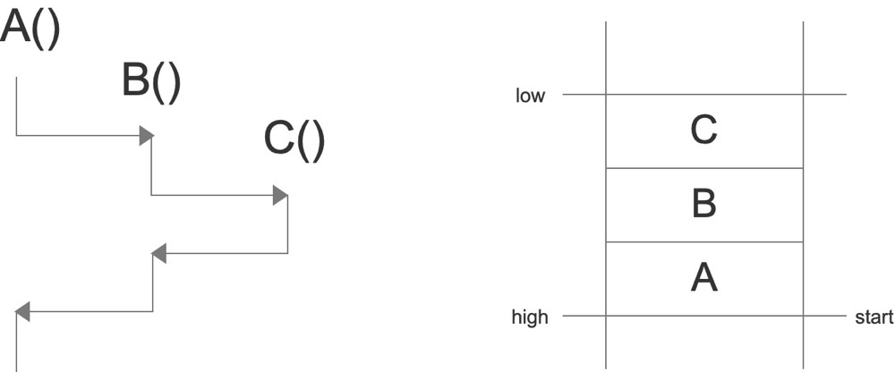

# 计算机科学基础知识之程序部分


程序构建
-------
程序构建的过程就是把写给人看的代码翻译成写给机器看的代码。当我们使用C语言编写了一个输出hello world的小程序，只需要`gcc hello.c`就会得到一个目标文件`a.out`，然后直接打开就可以输出。但是它的背后却没有这么简单:


这个过程大体上分为预处理(Prepressing)、编译(Compilation)、汇编(Assembly)和链接(Linking)。

### 预处理
也叫预编译，这一步主要进行如下处理:

* 将所有的`#define`删除，并展开所有的宏定义
* 处理所有的条件预编译指令，如`#if`、`#ifdef`等
* 处理`#include`，将被包含的文件插入到该位置，这个过程是递归的
* 删除所有的注释`//`和`/* ... */`
* 添加行号和文件名标识，便于后续编译时能产生调试信息
* 保留所有的`#pragma`指令，它是用来设定编译器状态或特殊动作的

这一步可以用过`gcc -E hello.c -o hello.i`来完成，预处理后的代码并非二进制所以可以直接打开。

### 编译
这个过程是整个程序构建最核心的部分，可以细分为词法分析、语法分析、语义分析、中间语言生成和目标代码生成优化这些小步:


这个过程我们可以通过`gcc -S hello.i -o hello.s`来做。实际上在GNU的标准中，gcc只是一些后台程序的包装，预处理和编译都使用一个叫cc1的程序，汇编器是as，链接器是ld。

#### 词法分析
源代码被输入到扫描器(Scanner)，扫描器运用有限状态机(Finite State Machine)的算法将源代码的字符序列分割成一系列的记号(Token)并给它们分好类。比如`array[index] = (index + 4) * (2 + 6)`这样一行源码经过扫描后会产生如下记号:

| 记号(Token) | 类型 |
| --- | --- |
| array | 标识符 |
| [ | 左方括号 |
| index | 标识符 |
| ] | 右方括号 |
| = | 赋值 |
| ( | 左圆括号 |
| index | 标识符 |
| + | 加号 |
| 4 | 数字 |
| ) | 右圆括号 |
| * | 乘号 |
| ( | 左圆括号 |
| 2 | 数字 |
| + | 加号 |
| 6 | 数字 |
| ) | 右圆括号 |

产生的记号可以分类为关键字、标识符、字面量(包含数字、字符串等)和特殊符号(如加号、乘号等)。识别记号的同时，扫描器还会将标识符存在符号表，将字面量存放到文字表。

#### 语法分析
接着，语法分析器(Grammar Parser)会对扫描器产生的记号进行语法分析，从而产生语法树(Syntax Tree)。上例中的表达式得到的语法树为:


整个分析过程采用一种叫上下文无关语法(Context-free Grammar)的手段，整个语句被看成一个赋值表达式，其左边是一个数组表达式，右边是一个乘法表达式。在这一步，运算符的优先级和含义被确定了下来，例如`*`既可以是乘号又可以是指针，在该表达式中具体指什么就是在这一步确定的。

#### 语义分析
语法分析只是对表达式语法层面进行了分析，它不了解这个语句是否是真正有意义的，比如C里面指针的乘法运算是没有意义的，但它是合乎语法的。那么此时，语义分析器(Semantic Analyzer)可以完成对静态语义的分析。

静态语义(Static Semantic)是指在编译期可以确定的语义，通常包括声明和类型的匹配，类型的转换，例如把一个浮点数赋值给整型表达式，其中的隐式类型转换的过程就由语义分析完成。而动态语义(Dynamic Semantic)是指在运行期出现的语义相关问题，例如将0作为除数是一个运行期语法错误。

此阶段，语法树中的表达式都被标识了类型，符号表里的符号类型也做了更新:


#### 中间语言生成
编译器下一步要做的是源码优化，上例中的(2+6)这个表达式在这一步会被优化掉，因为它的值编译期就是可以确定的。这个阶段，源码优化器(Source Code Optimizer)会将语法树转换为中间代码(Intermediate Code)，它是语法树的顺序表示，在不同编译器有不同的类型，常见的有三地址码(Three-address Code)和P-代码(P-Code)。三地址码即`x = y op z`，表示将y和z操作的结果复制给x，所以上例表达式会被转换为:
```
t1 = 2 + 6
t2 = index + 4
t3 = t2 * t1
array[index] = t3
```
经过优化后就是:
```
t1 = index + 4
t2 = t1 * 8
array[index] = t2
```
中间代码将编译器分为前端和后端，前端负责产生与机器无关的中间代码，后端负责把这些中间代码转换为目标机器上的代码，如此可以让编译器使用一个前端、多个后端，从而具备跨平台的能力。

#### 目标代码生成与优化
编译器后端主要包括代码生成器(Code Generator)和目标代码优化器(Target Code Optimizer)。由于目标机器有不同的字长、寄存器、整数数据类型等，代码生成器也就不相同，以x86为例，上例中间代码生成的汇编代码为:
```
movl index, %ecx
addl $4, %ecx
mull $8, %ecx
movl index, %eax
movl %ecx, array(,eax,4)
```

接着，目标代码优化器会进行优化，例如选择合适的寻址方式、通过位移来代替乘法运算、删除冗余指令等。上例中乘法可以由一条相对复杂的基址比例变址寻址(Basic Index Scale Addressing)的lea指令来完成，优化后的代码为:
```
movl index, %edx
leal 32(,%edx,8), %eax
movl %eax, array(,%edx,4)
```

### 汇编
汇编器是将汇编代码转变成机器可以执行的指令，每一个汇编语句几乎对应着一条机器指令。所以这一步其实相对简单，没有优化解析的过程，只需一一翻译就可以了。可以通过`gcc -c hello.s -o hello.o`来得到目标文件(Object File)。

### 链接
如果汇编指令当中的符号都是在一个编译单元内的，那么编译器就可以去确定这些符号的地址。然而现代软件往往是由复杂的模块构成的，即使是输出一个简单的hello world也要导入C标准库。那么每个源代码模块就需要单独的编译，然后按照顺序把它们组装起来，这个过程就是链接(Linking)。模块间的函数调用、变量引用等都是需要通过符号来通信的，链接器就是把指令中对于其他符号的引用加以修正，整个过程又包含了地址和空间分配(Address and Storage Allocation)、符号决议(Symbol Resolution,或名称绑定Name Binding)和重定位(Relocation)这些步骤。


#### 静态链接与动态链接
把多个目标模块(.o)打包成一个独立文件(.a)，这种方式称为静态库。我们在写自己的代码引用到静态库的某个函数的时候，实际上链接器是把静态库当做一个目标模块作为其输入。

相比于静态库内嵌的方式，动态链接库(.so文件或win下的.dll文件)是在运行时由动态链接器执行动态链接，它可被加载到任意位置。

很多库既提供了动态链接版本，也提供了静态库版本，比如C的标准库libc.so和libc.a。我们在编译的时候可以通过`gcc -static`来指定使用其静态库版本，这样编译好的目标文件就可以不依赖操作系统的环境去运行。Go语言就采用静态链接的方式，它的可执行程序往往复制在同类操作系统上就能运行。


可执行文件
-------

  

一个**可执行程序**看上去像是单个文件的数据库，我们以ELF格式的可执行文件为例，它包括头部元数据、Section header table、Program header table和各个section段。

### Head
文件头部包含一些元数据，用于进程加载找入口地址等:


[ubuntu] ~/.mac/assem $ readelf -h hello
ELF Header:
  Magic:   7f 45 4c 46 02 01 01 00 00 00 00 00 00 00 00 00      // 魔法数，可以快速读取出来用于预判整个文件是不是一个合法的内容
  Class:                             ELF64          // ELF文件的格式
  Data:                              2's complement, little endian  // 大小端情况
  Version:                           1 (current)
  OS/ABI:                            UNIX - System V    // 哪个平台使用
  ABI Version:                       0
  Type:                              EXEC (Executable file)     // 哪种类型，可执行的还是需重定位的等
  Machine:                           Advanced Micro Devices X86-64
  Version:                           0x1
  Entry point address:               0x4000b0       //入口地址
  Start of program headers:          64 (bytes into file)
  Start of section headers:          736 (bytes into file)
  Flags:                             0x0
  Size of this header:               64 (bytes)
  Size of program headers:           56 (bytes)
  Number of program headers:         2
  Size of section headers:           64 (bytes)
  Number of section headers:         8
  Section header string table index: 7


### Section
头部之后紧跟着各种各样的表，我们称之为**Section**(段)，各个section被计入可执行文件的Section header table中，我们可以这样查看:


[ubuntu] ~/.mac/assem $ readelf -S hello
There are 8 section headers, starting at offset 0x2e0:
Section Headers:
  [Nr] Name              Type             Address           Offset
       Size              EntSize          Flags  Link  Info  Align
  [ 0]                   NULL             0000000000000000  00000000
       0000000000000000  0000000000000000           0     0     0
  [ 1] .text             PROGBITS         00000000004000b0  000000b0
       0000000000000025  0000000000000000  AX       0     0     16
  [ 2] .data             PROGBITS         00000000006000d8  000000d8
       000000000000000e  0000000000000000  WA       0     0     4
  [ 3] .stab             PROGBITS         0000000000000000  000000e8
       0000000000000084  0000000000000014           4     0     4
  [ 4] .stabstr          STRTAB           0000000000000000  0000016c
       0000000000000009  0000000000000000           0     0     1
  [ 5] .symtab           SYMTAB           0000000000000000  00000178
       0000000000000108  0000000000000018           6     7     8
  [ 6] .strtab           STRTAB           0000000000000000  00000280
       0000000000000027  0000000000000000           0     0     1
  [ 7] .shstrtab         STRTAB           0000000000000000  000002a7
       0000000000000036  0000000000000000           0     0     1
Key to Flags:
  W (write), A (alloc), X (execute), M (merge), S (strings), I (info),
  L (link order), O (extra OS processing required), G (group), T (TLS),
  C (compressed), x (unknown), o (OS specific), E (exclude),
  l (large), p (processor specific)


其中，`Address`表示这个section加载到进程中的虚拟内存地址，`Offset`表示这个section相对于文件头部的偏移量，有了`Offset`+`Size`进程才知道如何安排相应的`Address`。`Flags`表示权限标志位，`A`表示这个section的内容需要在内存中载入，`X`表示可执行的权限，`W`表示可写入的权限。

`.text`用于存放二进制的执行代码(指令)。我们可以看到这个段的地址恰好是文件头中的Entry point address。

`.data`用于存放所有已经初始化过的全局变量的数据，`.bss`用于存放未初始化的全局变量数据，虽然它们在内存中都需要相应的起始地址和内存区域，但在可执行文件中没必要用一定区域去记下`.bss`中的零值。`.rodata`专门用于保存只读数据，例如字符串的字面量，在很多语言中它都是只读的。

`.symtab`表示符号表，存储了程序定义和引用的函数和全局变量信息:

* 当前模块内，可被外部引用的全局符号，比如函数和全局变量（非 static）。
* 只被当前模块定义和引用的本地符号，比如 static 函数和变量，不能被外部引用。
* 其他模块定义，被当前模块所引用的全局符号（external）。

对于程序运行来讲，符号表没有什么用，CPU不管什么符号、类型，它只需要内存地址。符号就相当于是内存地址的助记符，主要是便于我们调试和反汇编使用的。

### Segment
执行的时候，我们需要告诉操作系统，有哪些section需要载入为内存中的**segment**，这个信息被链接器放在Program header table中，操作系统的载入器以此信息来安排程序在内存中的样子，我们可以这样查看:


[ubuntu] ~/.mac/assem $ readelf -l hello
Elf file type is EXEC (Executable file)
Entry point 0x4000b0
There are 2 program headers, starting at offset 64
Program Headers:
  Type           Offset             VirtAddr           PhysAddr
                 FileSiz            MemSiz              Flags  Align
  LOAD           0x0000000000000000 0x0000000000400000 0x0000000000400000
                 0x00000000000000d5 0x00000000000000d5  R E    0x200000
  LOAD           0x00000000000000d8 0x00000000006000d8 0x00000000006000d8
                 0x000000000000000e 0x000000000000000e  RW     0x200000
 Section to Segment mapping:
  Segment Sections...
   00     .text
   01     .data


上面的section to segment mapping就表示把section中的`.text`段的内容放在内存中`00`号的segment上。在可执行文件中会把section分的很细，但在内存中可能会把一些section合并起来，忽略掉一些section，起到节约内存的目的。


函数调用
-------

**函数**本身相当于一个图纸，出了设计院它就是只读的，放在`.text`段中，线程参考图纸来执行。线程通过`IP/PC`寄存器知道执行到图纸的哪里，下一条指令是什么，主线程通过可执行文件的入口地址找到第一条指令。

### 调用堆栈
那么每个CPU核心只有一个IP寄存器，线程却有很多个怎么办？实际上在同一时刻，只有一个线程绑定了一套物理寄存器，若它的时间片用完了则由操作系统保存它对应的寄存器状态在某段内存中，下次轮到它执行时再恢复寄存器的状态。那么我们可以在抽象层面上理解为每个线程都有一套自己的寄存器。同时，这种切换线程需要消耗一定的资源，用于保存和恢复状态，用于内核态和用户态的切换。

函数执行过程中需要在线程中保存参数、返回值、局部变量等，这块内存叫做**栈**(Stack)。那么如果是嵌套调用，如何保存各函数的状态呢？



如左图所示，A函数嵌套了B函数，A要等待B执行完成之后再接着执行自己的逻辑。所以我们一般把栈内存竖着画，由底部的高位向低位分配，函数执行结束则把其对应的内存区域销毁，如右图所示。我们把每一个函数所占的格子叫**栈帧**(Stack Frame)，把整个A、B、C的调用层次称为**调用堆栈**(Call Stack)。程序出错时候我们看到一级级的错误信息就是通过调用堆栈追溯到的。

调用一个函数，在指令级别上还是有很大的开销的，所以有了**内联**(inline)的优化手段。

### 调用约定
接下来的问题是A调用B的时候，如何给B传递参数，如何接收B的返回值，要么A划定区域，要么B划定区域，要么用寄存器，要么用内存，我们把这种约定称为**调用约定**。以Go语言为例，若A调用B，则A会把自己的栈帧一分为二，下半部分存本地局部变量，上半部分存给B用的参数和B的返回值。若A调用B、C、D等多个函数，则上半部分占用多大空间按哪个函数的参数和返回值最大来算。如此一来，栈帧的大小是在编译期就能确定的，访问栈内某块内存只需根据相对位置，基于栈顶做加法或栈底做减法即可。

一般会把栈顶的地址放在SP寄存器，把栈底的地址放在BP寄存器。理论上，SP或者BP使用一个就够了，每个语言都有自己的选择。Go早期只用SP，后来也引入了BP，因为很多的调试器、自动化检测工具需要使用BP确定栈底的位置。

如果SP/BP用来存当前正在执行的B函数的栈帧，B执行完以后如何知道调用它的A函数的栈帧有多大呢？所以在两个栈帧之间还有一段空间用来存储A的BP/SP、IP，A在调用B的时候就把自己的BP/SP写进去，把自己调用完B之后下一条要执行什么指令写进IP，这叫**保存现场**。B执行完以后，通过这段空间恢复现场。接着，我们看看C语言和Go语言的保存现场和恢复现场分别是怎么做的。

#### Go语言

func add(x, y int) int {
	z := x + y
	return z
}

func main() {
	a, b := 0x11, 0x22
	s := add(a, b)
	println(s)
}


通过`go build -gcflags "-N -l" call.go`接着进行gdb调试:

(gdb) b 4
Breakpoint 1 at 0x452347: file /root/.mac/gocode/call.go, line 4.
(gdb) r
Thread 1 "call" hit Breakpoint 1, main.add (x=17, y=34, ~r2=0) at /root/.mac/gocode/call.go:4
4		z := x + y
(gdb) disass
Dump of assembler code for function main.add:
   0x0000000000452330 <+0>:	sub    rsp,0x10
   0x0000000000452334 <+4>:	mov    QWORD PTR [rsp+0x8],rbp
   0x0000000000452339 <+9>:	lea    rbp,[rsp+0x8]
   0x000000000045233e <+14>:	mov    QWORD PTR [rsp+0x28],0x0
=> 0x0000000000452347 <+23>:	mov    rax,QWORD PTR [rsp+0x18]
   0x000000000045234c <+28>:	add    rax,QWORD PTR [rsp+0x20]
   0x0000000000452351 <+33>:	mov    QWORD PTR [rsp],rax
   0x0000000000452355 <+37>:	mov    QWORD PTR [rsp+0x28],rax
   0x000000000045235a <+42>:	mov    rbp,QWORD PTR [rsp+0x8]
   0x000000000045235f <+47>:	add    rsp,0x10
   0x0000000000452363 <+51>:	ret
End of assembler dump.


我们可以把它的栈帧变化情况画出来:


#### C语言

int __attribute__((noinline, optimize("-O0"))) add(int x, int y)
{
    int z;
    z = x + y;
    return z;
}

int __attribute__((noinline)) main(int argc, char **argv)
{
    int x, y, a;
    x = 0x11;
    y = 0x22;
    a = add(x, y);
    printf("%d\n", a);
}


通过`gcc -g -O0 -o frame frame.c`接着进行gdb调试:

(gdb) b 5
Breakpoint 1 at 0x654: file frame.c, line 5.
(gdb) r
Breakpoint 1, add (x=17, y=34) at frame.c:6
6	    z = x + y;
(gdb) disass
Dump of assembler code for function add:
   0x000055555555464a <+0>:	push   rbp
   0x000055555555464b <+1>:	mov    rbp,rsp
   0x000055555555464e <+4>:	mov    DWORD PTR [rbp-0x14],edi
   0x0000555555554651 <+7>:	mov    DWORD PTR [rbp-0x18],esi
=> 0x0000555555554654 <+10>:	mov    edx,DWORD PTR [rbp-0x14]
   0x0000555555554657 <+13>:	mov    eax,DWORD PTR [rbp-0x18]
   0x000055555555465a <+16>:	add    eax,edx
   0x000055555555465c <+18>:	mov    DWORD PTR [rbp-0x4],eax
   0x000055555555465f <+21>:	mov    eax,DWORD PTR [rbp-0x4]
   0x0000555555554662 <+24>:	pop    rbp
   0x0000555555554663 <+25>:	ret
End of assembler dump.

同样可以画出图来:


#### 比较
相同点是在调用CALL指令的时候，先把main函数中执行完add函数的下一条指令(在IP寄存器中)存在栈里，在调用RET指令的时候，这条指令会被自动恢复入IP寄存器。

不同点是C语言通过`push`和`pop`指令入栈、出栈，让栈顶SP自动随着变化。而Go语言采用了`sub`、`add`指令直接计算栈顶地址。

此外，在C语言中，是优先通过寄存器传递参数和返回值，经常使用SI、DI寄存器传参，使用AX寄存器存储返回值，因为C是性能优先，寄存器肯定是最快的。Go是使用栈内存传参和返回值的，这和它本身Goroutine的运行方式有关。

### 栈和堆
堆、栈既是两种数据结构，也是函数执行单位，在不同的场景有不同的概念。

对于栈内存来讲，它是整块的，不需要垃圾回收器参与，访问的时候只需要根据BP、SP按相对位置进行访问，所以它的效率是非常高的。而堆内存是和单个线程无关的，是共享的，就会涉及到很复杂的内存管理方式，分配的时候要找到大小和位置合适的块，释放的时候要尽可能的避免内存碎片化。所以说，编译器有责任尽可能把数据分配在栈上。但是，栈上内存是按栈帧整块释放的，某些情况下如果某个变量要在不同的栈帧中维持，它的生命周期发生了改变，这种情况这个变量的内存就要在堆上分配了，这种现象就叫**逃逸**。逃逸也会带来严重的性能问题。